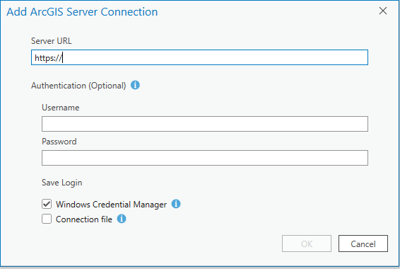
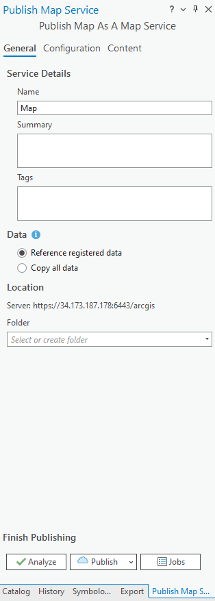
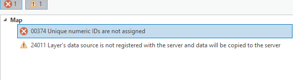
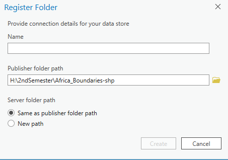

# Activity: Publishing a map service to the server via ArcGIS Pro   

### Date: 8th  March, 2024 

### Start Time: 18:00 

### End Time:18:40 

### Duration: 40 minutes 
      **Took longer than expected because the server connection was quite slow for some reason. Not sure why.**

### Status: Completed 

### Next Step: Explore Software Ideas to Proffer Solution to Problem Statement 

## Steps to follow: 

### Acquiring, Extracting, and Processing Data 
1. Head on over to your Google Cloud Platform account (Sign in if Signed out) 

1. Locate your VM instance and start it 

1. Once started, initiate a new virtual desktop session with the IP address and the saved password 

1. Within the virtual desktop, a zip file has already been placed by instructor.  

    * Extract the contents of this zip file into a directory of your choosing 

    * For this, the items were extracted into the gisworkspace folder 

1. Ensure you also have the exact same data downloaded on your local computer as well. 

1. Extract the data into a directory of your choosing ion your local computer 

### Establishing A Server Connection 

1. On the local computer, start up a new ArcGIS Pro session 

1. Give your map view a nice name 

1. Import the shapefile data that was extracted from the step above 

1. In the ribbon, select the Insert tab and click on the Connections icon 

1. From the connections drop down menu, hover over the server option 

    * A new list of items to choose from appears 

    * Select the New ArcGIS Server option from the list 

1. A new dialog box will appear as thus: 

1. In the Server URL tab, put in your ArcGIS Server URL. For this exercise It is: 

    * <https://externalIP:ArcGISServerPort/arcgis> 

1. Username will be your Username. For this exercise, however, it is siteadmin 

1. Password was given on D2L 

1. You may decide to save credentials, but this is not necessary as the IP address will change each time you fire up the virtual machine, hence changing the Server URL 

1. Once done, click OK 

1. You will be met with a certificate security alert. Click Yes  

1. Confirm this connection was successful from the catalog pane. 

      * Under the server folder, your server should be there 

### Publishing to Server: 

1. Right click on your server connection in the catalog pane and hover over the publish option 
1. Click on the Map service option  
1. Locate your current map view and select it 
1. You'll be greeted with this interface
 

1. Add the necessary info 
1. Under Data ensure that the Reference Original data option is checked 
1. For Folder section, you may choose to create a new folder to store this map or just dump it in the site(root)😉 
1.Before publishing, click on the Analyse option. This will reveal 1 error and 1 warning we absolutely must fix to proceed.

1. The first error can simply be fixed by right clicking on it and then selecting the Auto Assign IDs Sequentially option. 
1. The warning with number 24011 is especially dreadful. Y'see that "data will be copied to server" threat? We do not want that. 
    * Right click this warning and choose the Register Data source with server option. 
    * 
    * Name should be the same as your map view or any intuitive one 
    * Publisher folder path is the path that holds the data (shapefile) currently being displayed. The one we are attempting to publish via data referencing 
    * Server folder path is the path to the directory holding the extracted data of the same type on the SERVER. Very important to note this 
        * Selecting the first option from the photo indicates that both Publisher and Server paths have the same directory names and path. Only do this if this is true. Else.. 
        * Choose the second option and manually input the path to the data on the server 
1. After choosing the appropriate paths, click OK to register the data source 
1. For good measure, hit the Analyze button again to ensure the error and warning does not persist. If other errors or warnings exist, fret not. Error 00374 and warning 24011 are what we need to be concerned with. 
1. Once done and all things look good, hit Publish and chill 
1. Once it publishes, head on over to the rest service directory and play around with your published item!😉 
