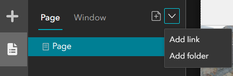
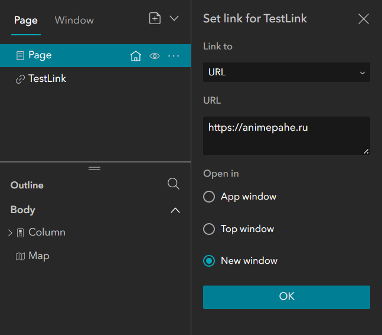
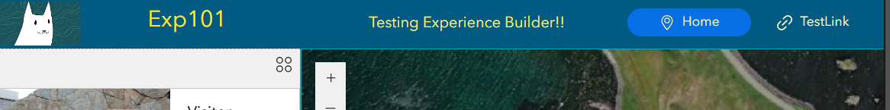

# Activity: Exploring Experience Builder Part 2 [Making a web app from scratch]
### Date: 20th March, 2024 
### Start Time: 22:00 
### End Time: 22:25 
### Duration: 25 minutes 
### Result: [My First WebPage with Experience Builder](https://experience.arcgis.com/experience/12ac253f7c874d34bae4fade370e2c07/page/Home/)
#### Outcomes:  
- Complete the web application set up with Experience Builder 
- Realize and understand the web app tiers involved in the Experience Builder architecture
### Steps: 
**_Following Part 1 of this log series, which you can reference [here](https://github.com/reddrabbit/Technical-Dev-Log/blob/main/webSolutions/ExperienceBuilder1.md ), this log entry will serve as a conclusion to ESRI's experience builder intro_**

- **Adding a Header Section**. On the left pane, locate the **Page** icon and then click the drop-down menu in the ribbon to add a link.
  -  
  - The link configuration window looks like this:
    -  
- Toggle on or off a header or footer section in the right pane. You can change the colour and size as well.
- Hover over the header section to either edit it with a template or drag and drop widgets from the Add widget pane on the left. 
- Once done, before exiting out of the header editor mode, drag in a Menu widget. This will make the link we set above become a navigation bar item! Pretty neat!
  - 
- Add in a footer as well if necessary 
- Once completed, click on the Play button on the ribbon to preview the web app 
- If everything looks good, publish the application. Ensure it is set to share with organization.  
- And that's it! 🙂
  
**_Note: The header and footer sections' items cannot be changed independently per page. I tried adding different kinds of information on the second page's footer and header, but they reflect on the home page's as well. There was no button or command in sight to unlink them_** 
    
